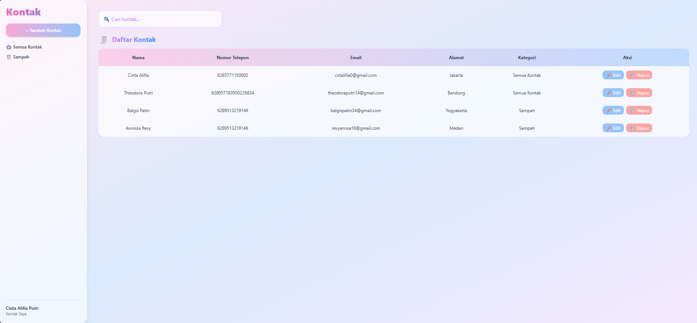
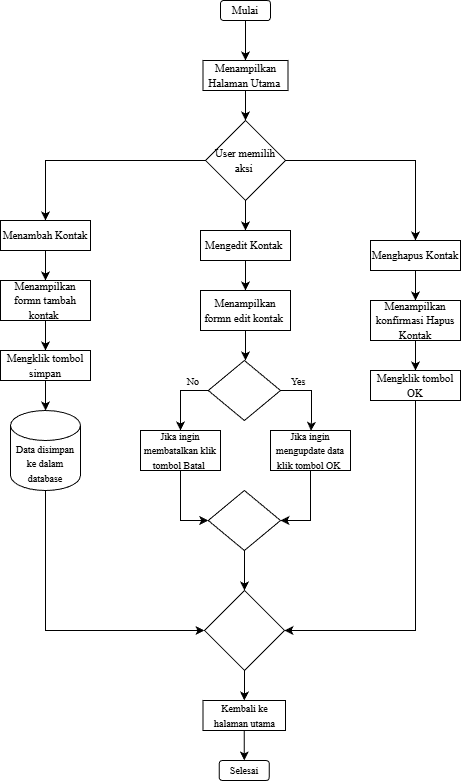

## 📸 Tampilan Aplikasi

# Address Book

Address Book adalah aplikasi web sederhana untuk mengelola data kontak. Aplikasi ini dibuat dengan konsep CRUD (Create, Read, Update, Delete) sehingga pengguna dapat menambah, melihat, mengedit, dan menghapus kontak dengan mudah.

## 🔗 Link

- 🌍 URL Deployment: https://addressbook-silk.vercel.app/
- 📁 Repository : https://github.com/cintalifia/addressbook.git

## ✨ Fitur Aplikasi

- ➕ Input Data (Create): Menambahkan kontak baru.
- 📄 Menampilkan Data (Read): Melihat daftar kontak yang tersimpan.
- ✏️ Mengubah Data (Update): Mengedit informasi kontak.
- 🗑️ Menghapus Data (Delete): Menghapus kontak yang tidak diperlukan.
- 🔍 Pencarian: Mencari kontak berdasarkan nama atau email.

## 🛠 Teknologi yang Digunakan

- 🌐 HTML — Membuat struktur dasar halaman Address Book.
- 🎨 CSS / Tailwind CSS — Mengatur tampilan, warna, layout, dan desain agar lebih modern.
- ⚙️ JavaScript — Mengelola logika aplikasi seperti tambah, edit, hapus, dan pencarian kontak.

## 🧩 Flowchart

Flowchart berikut menggambarkan alur kerja aplikasi Address Book, mulai dari proses menambah kontak, menampilkan data, mengubah data, hingga menghapus kontak.

